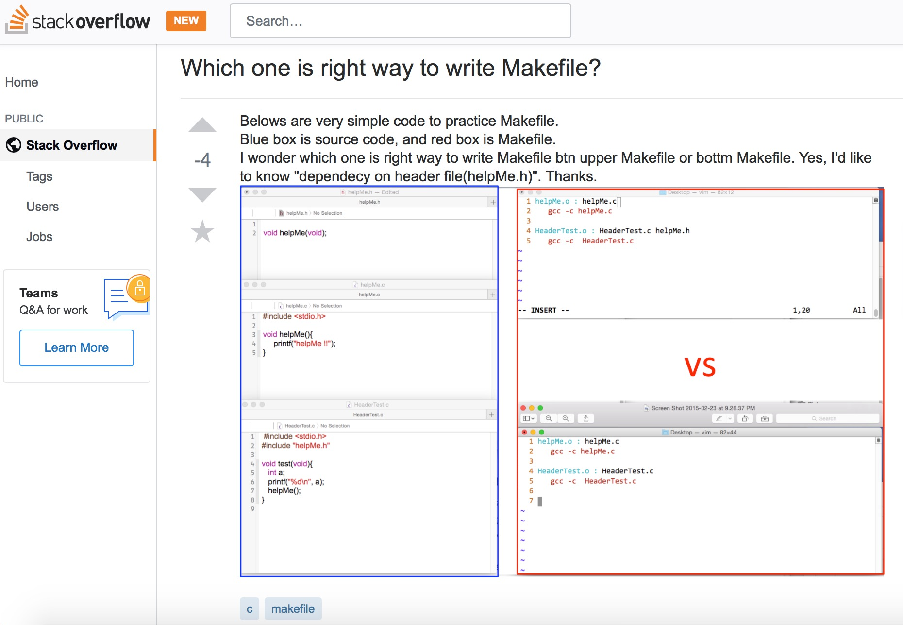
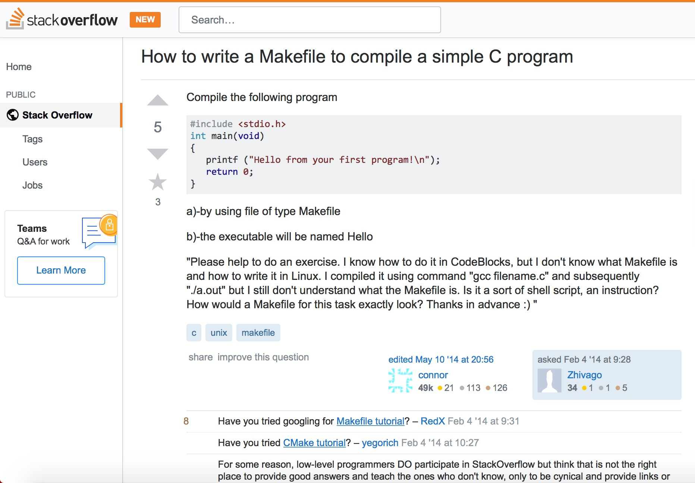

After reading the post of "How To Ask Questions The Smart Way" by Eric Steven Raymond, I feel it is very interesting. I really did not have much experience to ask the questions in online forums in the past, since I thought it was not that efficient, many questions have been raised and answered for many times and in the different places in the internet. If you can search correct keywords, you probably can find out the answers. But I realised that in the future, I may need to ask the questions and seek help from the online resources. It will be a good place to learn. To observe how people ask a good question and how people react on it, it is even an interesting topic for a research. 

I have collected both a bad example and a good example, please see the following links.
https://stackoverflow.com/questions/28673975/which-one-is-right-way-to-write-makefile

The bad example, which is against the rules of the Raymond, first of all, it used the informal and even the internet language “btn”, and second, the title is not that clear, he/she has asked “Which one is right way to write Makefile?” but he did not indicate that it is a C language, also the pictures the author provided is not very clear with very small text, which make the post difficult to read. Because the description of the problem is not that clear, the followups and answers to this post is never to the point. 

https://stackoverflow.com/questions/21548464/how-to-write-a-makefile-to-compile-a-simple-c-program

The good example, we can see here is very clear in term of the title, and the details he wrote. First of all, he give out the specific codes he try to compile, and also give the detailed instructions what is he asked to do, which is very easy to follow and also to answer. One can see that the followup and the answers to this post is quite a lot. And people are actively joining the discussion.

In sum, I feel that if you want a good and quick answers to your questions, one should spend more time on writing the details and whatever you have found so far, since if people see you are working hard on it, they will be more willing to help you out.

