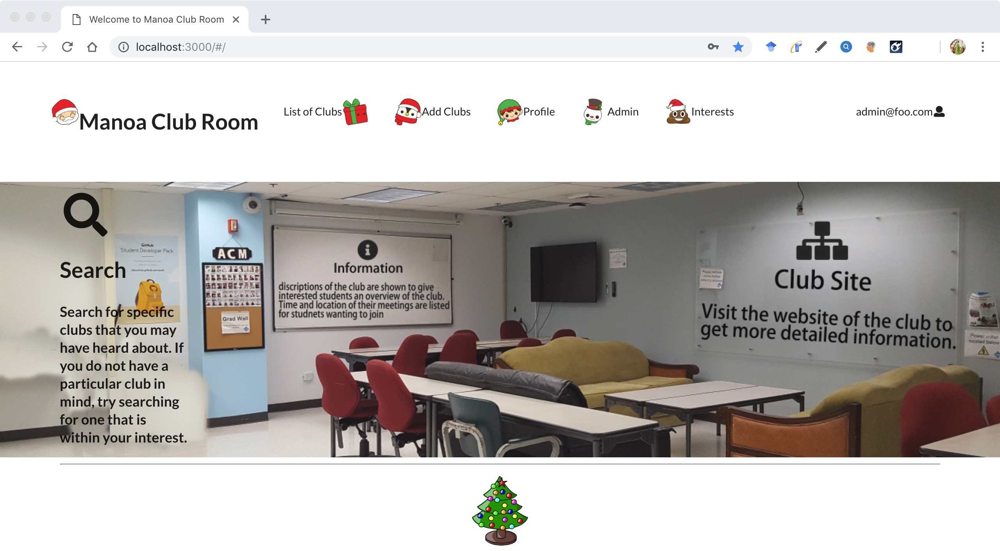
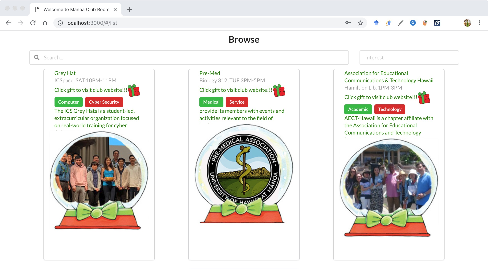
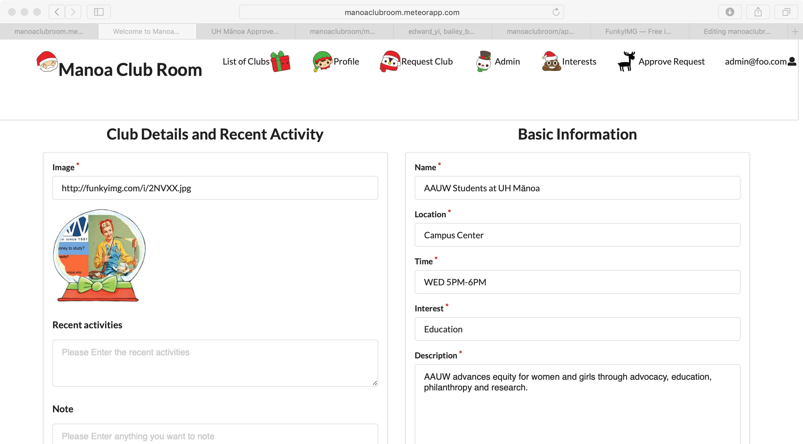

For the final project of ICS 314, I think I have learnt some important things in the software development which I never knew before. What is the teamwork? why coding standard is so important to a team, etc., Let’s me explain them in details.

Our team have four people, perhaps we are not technical best in our class, but every team member has very good personality, respect each other.  And also a little bit coincidence, we have the same vision of our project, we try our best to do what we can within the given time. I was so happy that no one in our team is very ambitious (sometimes work with the ambitious people is a disaster), and everyone understand that we should plan well and improve the work little by little, do not go back and forth. Although we do not meet often after the class, everyone response messages quickly in Slack. Also we do not have a team leader, but I can say everyone is the team leader, we are willing to do more things and cover more things and when there is gap, everyone try to fit the role automatically. I was glad to join this team.

But we also got some problems, everyone has different issues and tasks, for example, someone implement the edit club page (it's actually what I did). Then after that we found it may not be able to merge with the master branch, because we used different coding style, such as different names, I am the person to connect the different pages in the project, so I will really feel that the codes without any detailed comments, and no explanations what has changed to the whole master branch will be difficult to read and make merge judgement. It turned out that at last it is better to write a whole new codes to implement this function instead of connecting the ones with different codes. Therefore, I will think once we worked in a team, we need to be considerate how to put part of our work into the big picture, but not just only finish the work we are assigned. 

In the project, I have done the edit club page, add club page, connecting different pages, deployment and club information collection. I also designed most of the look of our website, my idea is to keep it as simple as possible but convey as much as information it can. This is the lesson I have learnt from my internship in one company, the website designer spent two months to make a new version of the website, the look is good, modern and fancy. However, it is not easy to find the information, I try to avoid this situations. To make things complicated, everyone can do, but keep simple and minimal style, it needs to think.

And last I want to say I was so happy and thankful to get the help from Dr. Moore and Vincent this semester, it is really my favourite and fun ICS course so far. 

Manoa Club room landing page:

Manoa Club room browse club page:

Manoa Club room edit club page:

The github page: 
[https://github.com/manoaclubroom](https://github.com/manoaclubroom)
