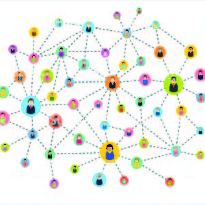

Abstract:
With the online social media becoming more and more popular, how to spread the information and make the online virality on the targets in a short time is critical. Although the quality of information may still play an important part in how it spread, this paper hold the quality of information as constant, and tries to figure out the other important factors on intermediaries, such as the structure of the social networks and the early adopters of the information. We model agents’ behaviours bases on their utility functions, and then see the effects of the different structure of simulated network and early adopters on the information diffusion. The results show that when the online social network exhibit the more small world property, the information spread is more widely, and when choosing the early adopters by the Page rank, the network has the best adoption rate, that is the retweet rates in the Twitter. Our study also show that even in the absence of empirical data, network sciences can still help us to interpret how information diffusion in the social media.

[The future works]
The reason why I selected this topic for the network science class is that I am very interesting in modelling and especially modelling the behaviour of the human being, which always failed in the reality. The other reason is that I also like the statistics. I have found that the literature in online vitality largely covered this two areas.

So you can see from the abstract that I got some theoretical results from the simulation models, but I can not see the application part, how the empirical results verify the theoretical part? I try to figure it out, but at least in the final report in the course I did not give an answer.

I was wondering if I want to continue this topic, what should be my focus?Perhaps to finish the empirical part will be my next destination.
